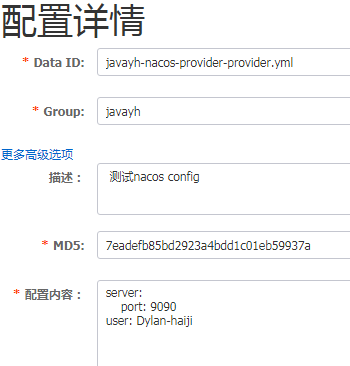
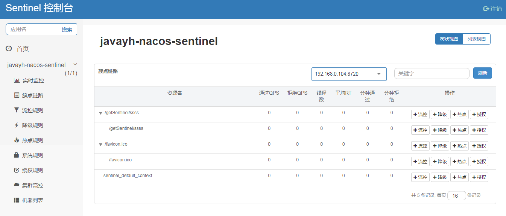
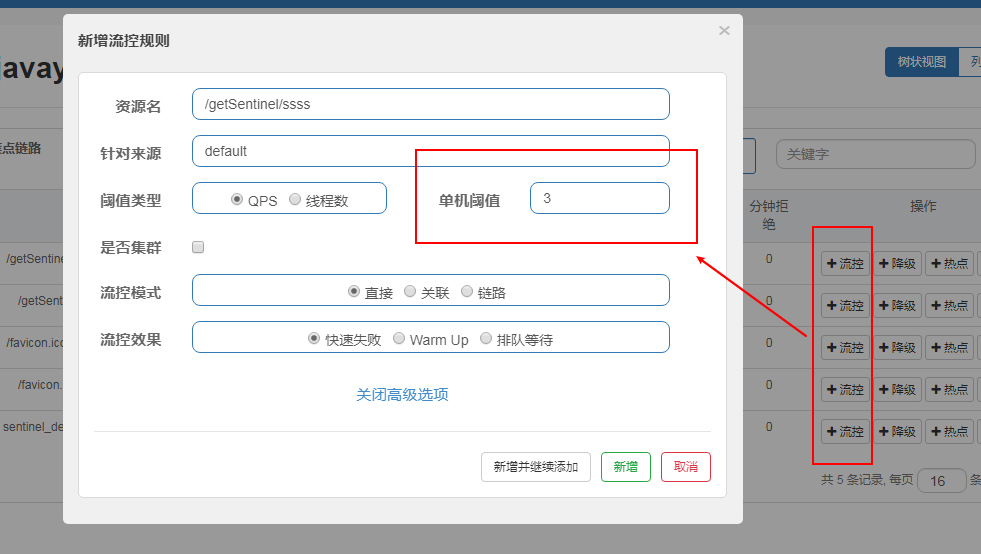

# Springboot2.X 整合 CloudAlibaba 

- 说明:
本代码禁用于学习总结,希望大家可以容忍代码存在的bug，遇到问题可以微信联系：372787553
- 本项目将用到微服务框架,如果你对微服务还比较陌生，可以去
https://github.com/Dylan-haiji/javayh-cloud 这里进行学习了解

## 一、项目结构
    --javayh-cloud-nacos                 顶级 
        --javayh-nacos-common            工具包
        --javayh-nacos-provide           服务生产者
        --javayh-nacos-consumer          服务消费者
        --javayh-nacos-sentinel          服务监控
        --javayh-nacos-zipkin            链式追踪服务
        --javayh-nacos-zuul              路由转发服务
      
## 二、技术架构
- SpringBoot
- SpringCloud
- SpringCloudAlibaba
- Nacos
- NacosConfig
- Sentinel
- Feign
- Zipkin
- Zuul

## 三、Nacos介绍
关于nacos的安装这里不过多解说，很简单，百度一下就可以
- 简介

>    Nacos 致力于帮助您发现、配置和管理微服务。Nacos 提供了一组简单易用的特性集，帮助您快速实现动态服务发现、服务配置、服务元数据及流量管理。
>
>    Nacos 帮助您更敏捷和容易地构建、交付和管理微服务平台。 Nacos 是构建以“服务”为中心的现代应用架构 (例如微服务范式、云原生范式) 的服务基础设施。
 
- 生态图

- 依赖

      <dependency>
           <groupId>org.springframework.cloud</groupId>
          <artifactId>spring-cloud-starter-alibaba-nacos-discovery</artifactId>
      </dependency>
       <dependency>
           <groupId>org.springframework.cloud</groupId>
           <artifactId>spring-cloud-alibaba-nacos-config</artifactId>
           <version>0.2.1.RELEASE</version>
       </dependency>
 
 ## 四、服务注册与调用     
 - provider配置
 
这里需要注意:配置文件的名必须是bootstrap.xxx,否则会报空指针异常，由于文件的加载顺序导致
    
        spring:
          application:
            name: javayh-nacos-provider
          profiles:
            active: provider
          cloud:
            nacos:
              discovery:
                server-addr: 127.0.0.1:8848
                cluster-name: javayh-nacos
              config:
                group: javayh
                server-addr: 127.0.0.1:8848
                prefix: javayh-nacos-provider
                file-extension: yml     
这时启动服务在控制就可以看到服务

 - consumer配置
 同provider配置，这里通过feign，进行服务调用，如果不了解feign的使用，请结合
https://github.com/Dylan-haiji/javayh-cloud进行学习

根结本案例的配置，调用接口：localhost:8091/consumer/find/{name},既可以看到效果

 ## 五、NacosConfig
 - NacosConfig配置
 
 
 
 **说明：**
>Data ID : prefix-active.file-extension
>
>Group   : group
>
>配置文件格式与file-extension格式统一
>
>需要在调用的方加上@RefreshScope注解,这时热加载，当你在改变配置时，会自动加载，无需重启服务

根据本案例的配置：更改user配置的值，调用接口http://localhost:9090/provider/getConfig
就可以发现效果，这里的端口其实就是读取的nacos的配置

## Sentinel介绍
这里的安装也不多说，就是一个boot工程，运行jar即可，用户名和密码默认是sentinel
- 简介
>分布式系统的流量哨兵，以流量为切入点，对比Redis的哨兵模式可以得出sentinel在微服务中的作用是对流量进行监控与管理，例如流量的控制，熔断降级，系统负载保护等。
>
>由Sentinel的源码可以看出，Sentinel在对流量进行管控的时候是通过责任链的模式来处理的。在Restful中，将系统的一切定义为资源，sentinel在此处也借鉴了此种思想，将需要流量控制的一切当做资源，然后定义一系列的规则来对资源进行处理。

- 依赖

        <dependency>
             <groupId>org.springframework.cloud</groupId>
             <artifactId>spring-cloud-starter-alibaba-sentinel</artifactId>
        </dependency>
- 配置
        
        spring:
          application:
            name: javayh-nacos-sentinel
          profiles:
            active: sentinel
          cloud:
            sentinel:
              transport:
                dashboard: 127.0.0.1:8080
- 控制台

http://localhost:8080                
启动服务调用接口:  http://localhost:8092/getSentinel/ssss，效果如下
    
 
-服务限流
如图；对本案例的借口进行限流操作，最多连续出发三次，但第四次是会出现图而的提示           
                   
 
      
 
 其他功能大家可以尝试
 本案例代码：https://github.com/Dylan-haiji/javayh-cloud-nacos
 ### 更多学习资料请看这里             
 - 微服务
 https://github.com/Dylan-haiji/javayh-cloud
 - 缓存、中间件
 https://github.com/Dylan-haiji/javayh-middleware
                        

   